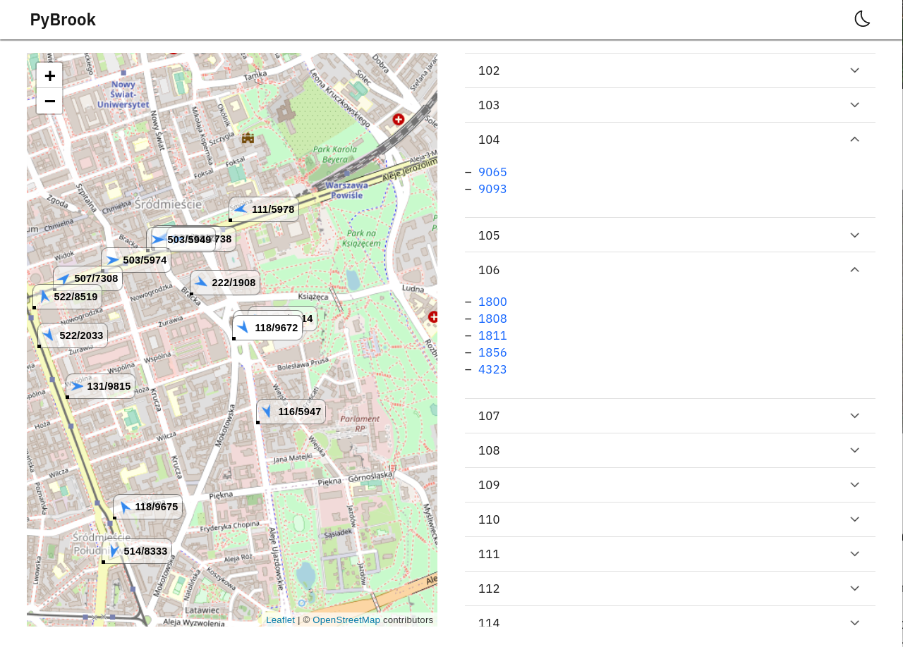

# Przykłady

## Formatowanie tekstu


```markdown
Test 1 2 3 _1 2 2_ **1 2 3**

- element 1
- element 2
    - element c

<https://elka.pw.edu.pl>
```

### Rezultat


Test 1 2 3 _1 2 2_ **1 2 3**

- element 1
- element 2
    - element c

<https://elka.pw.edu.pl>

## MathJax

```markdown
$1 +  \frac{q^2}{(1-q)}+\frac{q^6}{(1-q)(1-q^2)}+\cdots =
        \prod_{j=0}^{\infty}\frac{1}{(1-q^{5j+2})(1-q^{5j+3})},
         \quad\quad \text{for $|q| < 1$}.$

$$\frac{1}{(\sqrt{\phi \sqrt{5}}-\phi) e^{\frac25 \pi}} =
         1+\frac{e^{-2\pi}} {1+\frac{e^{-4\pi}} {1+\frac{e^{-6\pi}}
          {1+\frac{e^{-8\pi}} {1+\ldots} } } }$$

$$
\color{red}{\begin{pmatrix}a & b\\\ c & d\end{pmatrix}}
$$
```

### Rezultat

$1 +  \frac{q^2}{(1-q)}+\frac{q^6}{(1-q)(1-q^2)}+\cdots =
        \prod_{j=0}^{\infty}\frac{1}{(1-q^{5j+2})(1-q^{5j+3})},
         \quad\quad \text{for $|q| < 1$}.$

$$\frac{1}{(\sqrt{\phi \sqrt{5}}-\phi) e^{\frac25 \pi}} =
         1+\frac{e^{-2\pi}} {1+\frac{e^{-4\pi}} {1+\frac{e^{-6\pi}}
          {1+\frac{e^{-8\pi}} {1+\ldots} } } }$$

$$
\color{red}{\begin{pmatrix}a & b\\\ c & d\end{pmatrix}}
$$

$\begin{matrix} a & b \\ c & d \end{matrix}$


## Cytaty

```markdown
> \lipsum[1-2]  
> _Paulo Coelho_
```

### Rezultat

> \lipsum[1-2]  
> _Paulo Coelho_

## Cytowania

```markdown
To jest cytowanie [@lion2010][@wombat2016] 
```

### Rezultat

To jest cytowanie [@lion2010][@wombat2016]

## Notatki

```markdown
Footnote [^studia]

[^studia]: Studia elka: <https://studia.elka.pw.edu.pl>
```

### Rezultat
Footnote [^studia]

[^studia]: Studia elka: <https://studia.elka.pw.edu.pl>

## Tabele

```markdown
: Statystyki \label{tab:statsone}

| jeden| dwa   | trzy| 
|------|-------|-----|
| a    |   b   |  c  |
| c    |   *d* |  f  | 

Tabela \ref{tab:statsone}
```

### Rezultat

: Statystyki \label{tab:statsone}

| jeden| dwa   | trzy| 
|------|-------|-----|
| a    |   b   |  c  |
| c    |   *d* |  f  | 

Tabela \ref{tab:statsone}

## Rysunki

```markdown
{#fig:screenshot}

Odnośnik do zrzutu ekranu \ref{fig:screenshot}
```

### Rezultat
{#fig:screenshot}

Odnośnik do zrzutu ekranu \ref{fig:screenshot}

## Kod źródłowy

~~~
    ```{.python caption="FastAPI" #lst:singleton}
    from fastapi import FastAPI
    app = FastAPI()
    
    @app.get('/')
    async def index():
        return 'Hello, World!'  # <znak euro>
    ```
    
    Odnośnik do fragmentu kodu \ref{lst:singleton}
~~~

\newpage

```{.python caption="FastAPI" #lst:singleton}
from fastapi import FastAPI
app = FastAPI()

@app.get('/')
async def index():
    return 'Hello, World!' # €
```

Odnośnik do fragmentu kodu \ref{lst:singleton}
